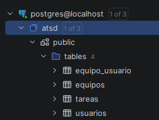
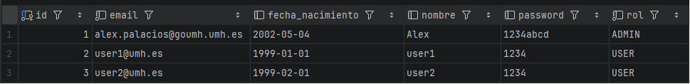
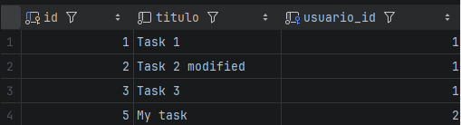
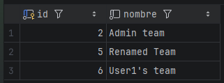
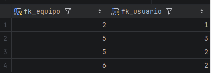

# Technical Documentation: Team Management Implementation (Issues 009 & 010)

This readme details the implementation of **Issue 009 (Manage Team Membership)** and **Issue 010 (Team Management)**, which provides the team member management and team administration functionalities. The implementation follows **Test-Driven Development (TDD)** methodology for the service and repository layers, while controller and view layers are developed following in a tradicional way.

## Endpoints
The implemented functionalities can be accessed through the following endpoints:

### Issue 009: Manage Team Membership (Requires authentication)
* [(GET) /teams/{id}](http://localhost:8080/teams/{id}): View details of a team and if the user is in the team

* [(POST) /teams/{id}/usuarios](http://localhost:8080/teams/{id}/usuarios): Join or leave a team (toggle membership)

### Issue 010: Team Management (Requires Admin Access)
* [(GET) /teams/{id}/edit](http://localhost:8080/teams/{id}/edit): Show the teams name change form.

* [(POST) /teams/{id}/edit](http://localhost:8080/teams/{id}/edit): Used for processing team's renaming form.

* [(POST) /teams/{id}/delete](http://localhost:8080/teams/{id}/delete): Deletes a team.


## Issue 009: Manage Team Membership

This issue enable users to create, join and leave teams. When the last user leaves a team, the team is automatically deleted from the database since we considered is the most logical approach. A team shouldn't be able to be empty.

### Implementation

#### 1. Model Layer

The `Equipo` entity had to be modified to include a method to safely remove users in the bidirectional relationship data structure found in the class by removing the user from the `usuarios` set and by removing the team in `teams` set in `Usuario` model.

```java
public void removeUsuario(Usuario usuario) {
    // Update both sides of the relationship
    this.getUsuarios().remove(usuario);
    usuario.getEquipos().remove(this);
}
```

#### 2. Service Layer

Business logic has been created for user-team relationship management. 

The first method added uses `removeUsuario(usuario)`, later checks if the team is empty (`equipo.getUsuarios().isEmpty()`) and then removes the team with `borrarEquipo(id)`.

```java
@Transactional
public void eliminarUsuarioDeEquipo(Long idEquipo, Long idUsuario) {
    Equipo equipo = equipoRepository.findById(idEquipo).orElse(null);
    if (equipo == null) throw new EquipoServiceException("El equipo no existe");
    
    Usuario usuario = usuarioRepository.findById(idUsuario).orElse(null);
    if (usuario == null) throw new EquipoServiceException("El usuario no existe");
    
    equipo.removeUsuario(usuario);
    
    // Automatically delete team if empty
    if (equipo.getUsuarios().isEmpty()) {
        borrarEquipo(equipo.getId());
    }
}
```
A method to check if a user is part of a team is also added. For that, we needed to create a new function in the repository (explained below).
```java
@Transactional
public boolean esUsuarioMiembro(Long usuarioId, Long equipoId) {
    return equipoRepository.existsByUsuariosIdAndId(usuarioId, equipoId);
}
```

There's also a method that was implemented later for obtaining in a clean DTO the team's information. Maps users from the team relationship into a `Set<UsuarioData>` structure.
```java
@Transactional
public EquipoDetalleData recuperarEquipoDetalle(Long id) {
    Equipo equipo = equipoRepository.findById(id).orElse(null);
    if (equipo == null)
        throw new EquipoServiceException("El equipo no existe");
    
    // Map directly to DetalleData
    EquipoDetalleData equipoDTO = modelMapper.map(equipo, EquipoDetalleData.class);
    
    // Convert the List of users to a Set for the DTO
    Set<UsuarioData> usuarios = equipo.getUsuarios().stream()
            .map(u -> modelMapper.map(u, UsuarioData.class))
            .collect(Collectors.toSet());
            
    equipoDTO.setUsuarios(usuarios);
    return equipoDTO;
}
```
A DTO was implemented with it, which only differs with TeamData by having a collection of users `Set<UsuarioData> usuarios`:
```java
public class EquipoDetalleData {

    private Long id;
    private String nombre;

    private Set<UsuarioData> usuarios = new HashSet<>();
    ...
}
```
#### 3. Repository Layer

The new repository function makes uses of `JPA` name derivation, looking in the join relationship if the user's id and team id are present, meaning that the user is part of the team:

```java
public interface EquipoRepository extends PagingAndSortingRepository<Equipo, Long> {
    boolean existsByUsuariosIdAndId(Long usuarioId, Long equipoId);
}
```
#### 4. Controller Layer
This layer uses the previous service methods implemented. 

The first controller method, a `GET` mapping endpoint, obtains the details of a team given it's id and redirects the user to its respective view. As others, checks that the user is authenticated.
```java
@GetMapping("/teams/{id}")
public String detalleEquipo(@PathVariable Long id, Model model, HttpSession session) {
    checkRegisteredUser();
    Long idUsuario = managerUserSession.usuarioLogeado();
    EquipoDetalleData equipo = equipoService.recuperarEquipoDetalle(id);

    model.addAttribute("equipo", equipo);
    //...
    return "detalleEquipo";
}
```

The `POST` endpoint toggles team membership. It removes the user if they’re already a member by checking `isMember`, otherwise adds them. 
If removing the user causes the team to be deleted (`EquipoServiceException` is thrown), the system redirects them to the team list instead of the deleted team's details.
```java
@PostMapping("/teams/{id}/usuarios")
public String gestionarMiembroEquipo(@PathVariable Long id) {
    checkRegisteredUser();
    Long idUsuario = managerUserSession.usuarioLogeado();

    List<UsuarioData> usuarios = equipoService.usuariosEquipo(id);
    //boolean isMember = usuarios.stream().anyMatch(u -> u.getId().equals(idUsuario));
    boolean isMember = equipoService.esUsuarioMiembro(idUsuario, id);

    if (isMember) {
        equipoService.eliminarUsuarioDeEquipo(id, idUsuario);
        try {
            equipoService.recuperarEquipo(id);
            return "redirect:/teams/" + id;
        } catch (Exception e) {
            // Team was deleted (e.g., last member left)
            return "redirect:/teams";
        }
    } else {
        equipoService.añadirUsuarioAEquipo(id, idUsuario);
        return "redirect:/teams/" + id;
    }
}
```
#### 5. View Layer
The resource `detalleEquipo.html` was implemented for showing a team's detail and it's member. Its remarkable part is that the form for joining and leaving makes uses of `isMember` attribute for showing one or the other obtained from the `controller`.
```html
<div class="row mt-3">
    <div class="col">
        <form method="POST" th:action="@{/teams/{id}/usuarios(id=${equipo.id})}" style="display: inline;">
            <!-- isMember should be sent from the controller using the service layer to retrieve the value -->
            <!-- <th:block th:with="isMember=${equipo.usuarios != null and equipo.usuarios.?[id == #vars.currentUserId].size() > 0}">-->
            <th:block>
                <button th:if="${isMember}" type="submit" class="btn btn-danger">Leave Team</button>
                <button th:unless="${isMember}" type="submit" class="btn btn-success">Join Team</button>
            </th:block>
        </form>
        <!--...-->
        <a th:href="@{/teams}" class="btn btn-secondary">Back to Teams</a>
    </div>
</div>
```
#### 6. Implemented Tests 
The next tests have been developed. Service and repository tests were implemented before their respective methods, following TDD methodology.

**Service Layer Tests**:
- **`eliminarUsuarioDeEquipoTest`**: Verifies user removal from team with multiple members.

```java
@Test
public void eliminarUsuarioDeEquipoTest() {
    // GIVEN: Users in a team
    EquipoData equipo = equipoService.crearEquipo("Proyecto 1");
    equipoService.añadirUsuarioAEquipo(equipo.getId(), usuario1.getId());
    equipoService.añadirUsuarioAEquipo(equipo.getId(), usuario2.getId());
    
    // WHEN: User is removed
    equipoService.eliminarUsuarioDeEquipo(equipo.getId(), usuario1.getId());
    
    // THEN: Team still exists with one member
    assertThat(equipoService.usuariosEquipo(equipo.getId())).hasSize(1);
}
```

- **`eliminarUltimoUsuarioEliminaEquipoTest`**: Confirms automatic team deletion when last member leaves.

```java
@Test
public void eliminarUltimoUsuarioEliminaEquipoTest() {
    // GIVEN: Single user in a team
    equipoService.añadirUsuarioAEquipo(equipo.getId(), usuario.getId());
    
    // WHEN: Last user is removed
    equipoService.eliminarUsuarioDeEquipo(equipo.getId(), usuario.getId());
    
    // THEN: Team is automatically deleted
    assertThatThrownBy(() -> equipoService.recuperarEquipo(equipo.getId()))
        .isInstanceOf(EquipoServiceException.class);
}
```

**Controller Layer Tests**:
- **`testJoinButtonPresence`**: Confirms that the join button is present when a user is not in the team. Mocks a team when calling `recuperarEquipoDetalle` and `isMember` to false when calls `esUsuarioMiembro`.
```java
@Test
public void testJoinButtonPresence() throws Exception {
    when(managerUserSession.usuarioLogeado()).thenReturn(1L);
    EquipoDetalleData equipo = crearEquipoDetalle(1L, "Proyecto 1");
    when(equipoService.recuperarEquipoDetalle(1L)).thenReturn(equipo);
    when(equipoService.esUsuarioMiembro(1L, 1L)).thenReturn(false);

    mockMvc.perform(get("/teams/1")
            .sessionAttr("idUsuarioLogeado", 1L))
            .andExpect(status().isOk())
            .andExpect(content().string(containsString("Join Team")));
}
```

- **`testLeaveButtonPresence`**: Confirms that the leave button is present when a user is already in a team. Mocks sames elements as the one before but `isMember` is set to `true`.
```java
@Test
public void testLeaveButtonPresence() throws Exception {
        when(managerUserSession.usuarioLogeado()).thenReturn(1L);
        EquipoDetalleData equipo = crearEquipoDetalle(1L, "Proyecto 1");
        when(equipoService.recuperarEquipoDetalle(1L)).thenReturn(equipo);
        when(equipoService.esUsuarioMiembro(1L, 1L)).thenReturn(true);

        mockMvc.perform(get("/teams/1")
                .sessionAttr("idUsuarioLogeado", 1L))
                .andExpect(status().isOk())
                .andExpect(content().string(containsString("Leave Team")));
}
```


## Issue 010: Team Management

Provide administrative functionality to rename and delete teams with role-based access control. Only users with the `ADMIN` role can see and use these options.

### Implementation

#### 1. Repository Layer — `EquipoRepository.java`

No new methods were needed. The `deleteById` method inherited from `CrudRepository` is sufficient for team deletion. The repository tests verify that these inherited operations work correctly:

- **`guardarActualizaNombreTest`**: Creates and persists a team, updates its name with `save`, and verifies the stored record reflects the new name.
- **`eliminarEquipoTest`**: Persists a team, calls `deleteById`, and verifies `findById` returns an empty `Optional`.

#### 2. Service Layer (TDD Approach)

The following methods have been implemented in the service layer to enable the administrator to manage the created teams.

- **`renombrarEquipo`**: This first method finds the team by ID, updates its name and save it with the current changes.

```java
@Transactional
public void renombrarEquipo(Long id, String nuevoNombre) {
    Equipo equipo = equipoRepository.findById(id)
        .orElseThrow(() -> new EquipoServiceException("El equipo no existe"));
    equipo.setNombre(nuevoNombre);
    equipoRepository.save(equipo);
}
```

- **`eliminarEquipo`**: The second method verifies that the team exists before deletion. It uses `deleteById` method of the repository to carry out the removal process.

```java
@Transactional
public void eliminarEquipo(Long id) {
    Equipo equipo = equipoRepository.findById(id)
        .orElseThrow(() -> new EquipoServiceException("El equipo no existe"));
    equipoRepository.deleteById(id);
}
```
In both methods, if the team is not found the EquipoServiceException is thrown, maintaining consistent error handling across the service layer


#### 3. Controller Layer with Access Control

In the controller have been implemented three admin endpoints which share the same authorization patter. First, `checkedRegisteredUser()` verifies an active session exists, then `managerUserSession.isAdmin()` verifies the user has the admin role. If either checkfails, `AccesoNoAutorizadoException` is thrown, which maps to HTTP 403 code status via `@ResponseStatus`.

-**`editarEquipo`**: Loads the current team data into an `EquipoData` object bound to `equipoData` in the model, pre-filling the rename form with the existing name.

```java
@GetMapping("/teams/{id}/edit")
public String editarEquipo(@PathVariable Long id, Model model) {
    checkRegisteredUser();
    if (!managerUserSession.isAdmin()) {
        throw new AccesoNoAutorizadoException();
    }
    EquipoData equipo = equipoService.recuperarEquipo(id);
    model.addAttribute("equipoData", equipo);
    return "editarEquipo";
}
```

-**`actualizarEquipo`**: Calls `renombrarEquipo` with the submitted name and redirects to `/teams/{id}` on success. On `EquipoServiceException`, returns the edit form with the error message.

```java
@PostMapping("/teams/{id}/edit")
public String actualizarEquipo(@PathVariable Long id, @ModelAttribute EquipoData equipoData) {
    checkRegisteredUser();
    if (!managerUserSession.isAdmin()) {
        throw new AccesoNoAutorizadoException();
    }
    equipoService.renombrarEquipo(id, equipoData.getNombre());
    return "redirect:/teams/" + id;
}
```

-**`eliminarEquipo`**: Calls `eliminarEquipo` and redirects to `/teams`. Since the team no longer exists after deletion, redirecting to the detail page is not possible.

```java
@PostMapping("/teams/{id}/delete")
public String eliminarEquipo(@PathVariable Long id) {
    checkRegisteredUser();
    if (!managerUserSession.isAdmin()) {
        throw new AccesoNoAutorizadoException();
    }
    equipoService.eliminarEquipo(id);
    return "redirect:/teams";
}
```

#### 4. View Layer

**`detalleEquipo.html`**: Admin buttons are wrapped in a `th:block` that evaluates the `isAdmin()` method on the `managerUserSession` bean directly from the template using the `@` Spring bean syntax:

```html
<th:block th:if="${@managerUserSession.isAdmin()}">
    <a th:href="@{/teams/{id}/edit(id=${equipo.id})}" class="btn btn-warning">Rename Team</a>
    <form method="POST" th:action="@{/teams/{id}/delete(id=${equipo.id})}" 
          style="display: inline;" onsubmit="return confirm('Delete this team?');">
        <button type="submit" class="btn btn-danger">Delete Team</button>
    </form>
</th:block>
```

**`editarEquipo.html`**: A form pre-filled with `${equipoData.nombre}` via `th:value`. Submits to `POST /teams/{id}/edit`. Displays a Bootstrap danger alert when the `error` attribute is present. Includes a cancel link back to `/teams/{id}`.

```html
<div th:if="${error != null}" class="alert alert-danger alert-dismissible fade show mt-3" role="alert">
            <span th:text="${error}">Error message</span>
            <button type="button" class="close" data-dismiss="alert" aria-label="Close">
                <span aria-hidden="true">&times;</span>
            </button>
        </div>
        <div class="row mt-3">
            <div class="col-md-6">
                <form method="POST" th:action="@{/teams/{id}/edit(id=${equipoData.id})}" th:object="${equipoData}">
                    <div class="form-group">
                        <label for="nombre">Team Name</label>
                        <input type="text" class="form-control" id="nombre" name="nombre" placeholder="Enter new team name" th:field="*{nombre}" required>
                    </div>
                    <button type="submit" class="btn btn-primary">Save Changes</button>
                    <a th:href="@{/teams/{id}(id=${equipoData.id})}" class="btn btn-secondary">Cancel</a>
                </form>
            </div>
        </div>
</div>
```


#### 5. Implemented Tests

**Service Layer Tests**: use `@SpringBootTest` with H2 to verify the full transactional behavior against a real database:

- **`renombrarEquipoTest`**: Mocks `findById` returning a team, calls `renombrarEquipo`, and uses `verify(equipoRepository).save(equipo)` to confirm the updated entity was persisted.

```java
@Test
public void renombrarEquipoTest() {
    // GIVEN
    // Un equipo en la base de datos
    EquipoData equipo = equipoService.crearEquipo("Proyecto Original");
    Long equipoId = equipo.getId();

    // WHEN
    // Renombramos el equipo
    equipoService.renombrarEquipo(equipoId, "Proyecto Actualizado");

    // THEN
    // Recuperamos el equipo y verificamos que el nombre cambió
    EquipoData equipoActualizado = equipoService.recuperarEquipo(equipoId);
    assertThat(equipoActualizado.getNombre()).isEqualTo("Proyecto Actualizado");
}
```

- **`eliminarEquipoTest`**: Mocks `findById` returning a team, calls `eliminarEquipo`, and uses `verify(equipoRepository).deleteById(1L)` to confirm the correct deletion method was invoked.

```java
@Test
public void eliminarEquipoTest() {
    // GIVEN
    // Un equipo en la base de datos
    EquipoData equipo = equipoService.crearEquipo("Proyecto a Eliminar");
    Long equipoId = equipo.getId();

    // WHEN
    // Eliminamos el equipo
    equipoService.eliminarEquipo(equipoId);

    // THEN
    // Verificamos que el equipo ya no existe
    assertThatThrownBy(() -> equipoService.recuperarEquipo(equipoId))
            .isInstanceOf(EquipoServiceException.class)
            .hasMessageContaining("El equipo no existe");
}
```

- **`comprobarExcepciones`**: Verifies that both `renombrarEquipo` and `eliminarEquipo` throw `EquipoServiceException` when the team does not exist, alongside all pre-existing exception checks.

```java
@Test
public void comprobarExcepciones() {
    // Comprobamos las excepciones lanzadas por los métodos
    // recuperarEquipo, añadirUsuarioAEquipo, usuariosEquipo y equiposUsuario
    assertThatThrownBy(() -> equipoService.recuperarEquipo(1L))
            .isInstanceOf(EquipoServiceException.class);
    assertThatThrownBy(() -> equipoService.añadirUsuarioAEquipo(1L, 1L))
            .isInstanceOf(EquipoServiceException.class);
    assertThatThrownBy(() -> equipoService.usuariosEquipo(1L))
            .isInstanceOf(EquipoServiceException.class);
    assertThatThrownBy(() -> equipoService.equiposUsuario(1L))
            .isInstanceOf(EquipoServiceException.class);
    assertThatThrownBy(() -> equipoService.renombrarEquipo(1L, "New Project 1 3DS"))
            .isInstanceOf(EquipoServiceException.class);
    assertThatThrownBy(() -> equipoService.eliminarEquipo(1L))
            .isInstanceOf(EquipoServiceException.class);

    // Creamos un equipo pero no un usuario
    // y comprobamos que también se lanza una excepción
    EquipoData equipo = equipoService.crearEquipo("Project 1");
    assertThatThrownBy(() -> equipoService.añadirUsuarioAEquipo(equipo.getId(), 1L))
            .isInstanceOf(EquipoServiceException.class);

    // Comprobar que crear equipo con nombre duplicado lanza excepcion
    assertThatThrownBy(() -> equipoService.crearEquipo("Project 1"))
            .isInstanceOf(EquipoServiceException.class);
}
```

**Controller Layer Tests**: verify role-based access and correct redirects:

- **`testAdminSeesRenameAndDeleteButtons`**: Mocks `isAdmin()` returning `true` and verifies both "Rename Team" and "Delete Team" appear in the rendered HTML.

```java
@Test
public void testAdminSeesRenameAndDeleteButtons() throws Exception {
    when(managerUserSession.isAdmin()).thenReturn(true);
    mockMvc.perform(get("/teams/1").sessionAttr("idUsuarioLogeado", 1L))
        .andExpect(content().string(containsString("Rename Team")))
        .andExpect(content().string(containsString("Delete Team")));
}
```
- **`testNonAdminDoesNotSeeAdminButtons`**: Mocks `isAdmin()` returning `false` and verifies neither button is present.

```java
@Test
public void testNonAdminDoesNotSeeAdminButtons() throws Exception {
    when(managerUserSession.usuarioLogeado()).thenReturn(1L);
    EquipoDetalleData equipo = crearEquipoDetalle(1L, "Proyecto 1");
    when(equipoService.recuperarEquipoDetalle(1L)).thenReturn(equipo);
    when(equipoService.esUsuarioMiembro(1L, 1L)).thenReturn(false);
    when(managerUserSession.isAdmin()).thenReturn(false);

    mockMvc.perform(get("/teams/1")
            .sessionAttr("idUsuarioLogeado", 1L))
            .andExpect(status().isOk())
            .andExpect(content().string(not(containsString("Rename Team"))))
            .andExpect(content().string(not(containsString("Delete Team"))));
}
```
- **`testNonAdminCannotAccessEditForm`**: Mocks a non-admin user and verifies `GET /teams/{id}/edit` returns HTTP 403.

```java
@Test
public void testNonAdminCannotAccessEditForm() throws Exception {
    when(managerUserSession.isAdmin()).thenReturn(false);
    mockMvc.perform(get("/teams/1/edit").sessionAttr("idUsuarioLogeado", 1L))
        .andExpect(status().isForbidden());
}
```

- **`testGuestCannotAccessEditForm`**: Mocks a guest user and verifies `GET /teams/{id}/edit` returns HTTP 403.

```java
@Test
public void testGuestCannotAccessEditForm() throws Exception {
    when(managerUserSession.usuarioLogeado()).thenReturn(null);

    mockMvc.perform(get("/teams/1/edit"))
            .andExpect(status().isForbidden());
}
```
- **`testAdminCanAccessEditForm`**: Mocks an admin user and verifies the edit form loads with HTTP 200.

```java
@Test
public void testAdminCanAccessEditForm() throws Exception {
    when(managerUserSession.usuarioLogeado()).thenReturn(1L);
    when(managerUserSession.isAdmin()).thenReturn(true);
    when(equipoService.recuperarEquipo(1L)).thenReturn(crearEquipo(1L, "Proyecto 1"));

    mockMvc.perform(get("/teams/1/edit")
            .sessionAttr("idUsuarioLogeado", 1L))
            .andExpect(status().isOk())
            .andExpect(content().string(containsString("Rename Team")))
            .andExpect(content().string(containsString("Save Changes")));
}
```
- **`testPostRenameRedirectsToTeamDetail`**: Mocks an admin and verifies `POST /teams/{id}/edit` redirects to `/teams/{id}`.

```java
@Test
public void testPostRenameRedirectsToTeamDetail() throws Exception {
    when(managerUserSession.usuarioLogeado()).thenReturn(1L);
    when(managerUserSession.isAdmin()).thenReturn(true);

    mockMvc.perform(post("/teams/1/edit")
            .sessionAttr("idUsuarioLogeado", 1L)
            .param("nombre", "Nuevo Nombre"))
            .andExpect(status().is3xxRedirection())
            .andExpect(redirectedUrl("/teams/1"));
}
```
- **`testPostDeleteRedirectsToTeamList`**: Mocks an admin and verifies `POST /teams/{id}/delete` redirects to `/teams`.

```java
@Test
public void testPostDeleteRedirectsToTeamList() throws Exception {
    when(managerUserSession.usuarioLogeado()).thenReturn(1L);
    when(managerUserSession.isAdmin()).thenReturn(true);

    mockMvc.perform(post("/teams/1/delete")
            .sessionAttr("idUsuarioLogeado", 1L))
            .andExpect(status().is3xxRedirection())
            .andExpect(redirectedUrl("/teams"));
}
```

## Database Screenshots

### Usuarios


### Tareas


### Teams


### Teams - Users relationship
